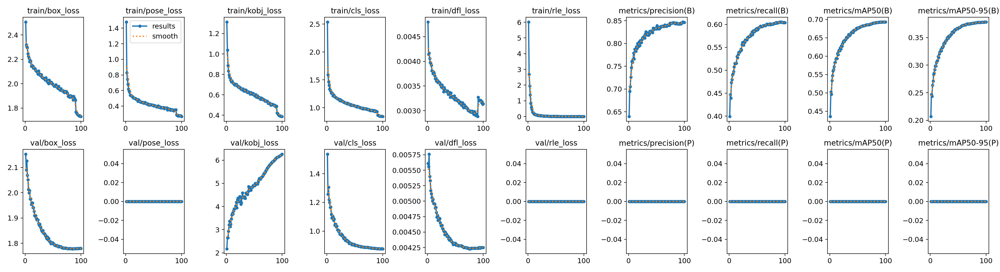
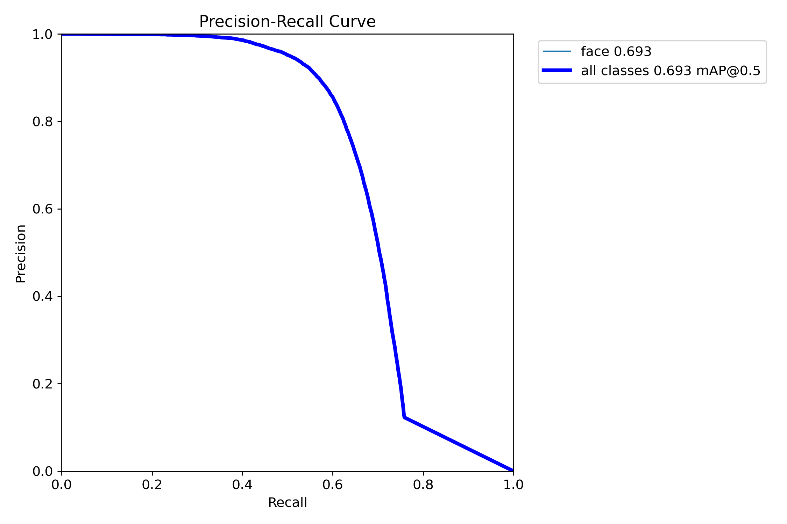
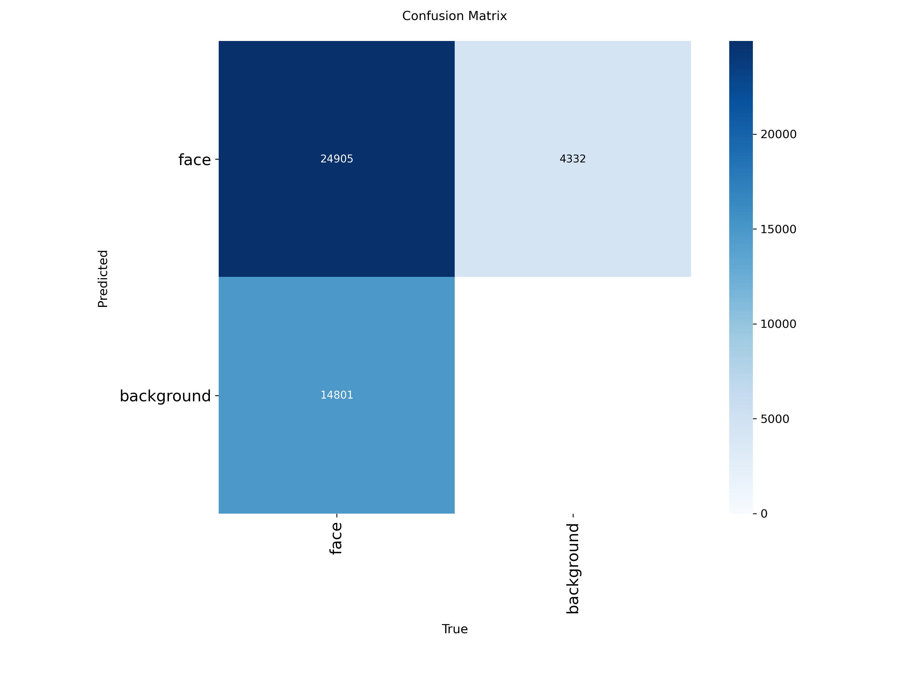

# YOLO26 Face

Reference repository for training and evaluating **YOLO26** on face detection with **5 facial keypoints** using a WIDER Face style dataset layout.

This repo is intended to be a clean public starting point for:

- fine-tuning `yolo26n.pt` and `yolo26s.pt` for faces
- converting WIDER Face style annotations to Ultralytics YOLO pose labels
- reproducing baseline training runs
- publishing training curves and checkpoints

## What This Repo Contains

- [`train.py`](train.py): main training entrypoint for YOLO26 face + keypoints
- [`predict.py`](predict.py): simple inference script for images, folders, videos, or webcam streams
- [`dataset/train2yolo.py`](dataset/train2yolo.py): converts WIDER-style training labels with landmarks to YOLO pose format
- [`dataset/val2yolo.py`](dataset/val2yolo.py): converts WIDER-style validation labels to YOLO pose format
- [`dataset/data.yaml.example`](dataset/data.yaml.example): dataset config template
- [`runs/pose/face/yolo26n`](runs/pose/face/yolo26n): current `yolo26n` training artifacts

## Task Setup

- Task: face detection + 5 facial keypoints
- Class count: `1`
- Class names: `["face"]`
- Keypoint shape: `5 x 3`
- Expected YOLO label format:

```text
class cx cy w h kp1_x kp1_y kp1_v kp2_x kp2_y kp2_v kp3_x kp3_y kp3_v kp4_x kp4_y kp4_v kp5_x kp5_y kp5_v
```

`train.py` validates this format before training starts.

## Dataset

This repo is built around a **WIDER Face style dataset** converted into Ultralytics YOLO pose labels.

Expected dataset layout:

```text
dataset/
  data.yaml
  train/
    0_Parade_marchingband_1_849.jpg
    0_Parade_marchingband_1_849.txt
    ...
  val/
    0.jpg
    0.txt
    ...
```

Start from the template:

```bash
copy dataset\data.yaml.example dataset\data.yaml
```

Then update the paths inside `dataset/data.yaml` to match your local dataset.

## Installation

Create a fresh environment and install dependencies:

```bash
python -m venv .venv
.venv\Scripts\activate
pip install -r requirements.txt
```

If you already have a CUDA-enabled PyTorch install, keep your current Torch build and install the remaining packages from `requirements.txt`.

## WIDER Face Conversion

### Train split

Convert WIDER-style train labels with landmarks to YOLO pose format:

```bash
python dataset/train2yolo.py D:\Datasets\WIDERFACE\train dataset\train
```

This expects:

```text
D:\Datasets\WIDERFACE\train\
  label.txt
  images\
```

### Val split

Convert WIDER-style validation labels:

```bash
python dataset/val2yolo.py D:\Datasets\WIDERFACE dataset\val
```

This expects:

```text
D:\Datasets\WIDERFACE\
  val\
    label.txt
    images\
```

Note: the current validation converter writes face boxes and fills the 5 keypoints with `0 0 0` because standard WIDER Face validation annotations do not provide facial landmarks. That means pose validation metrics are not meaningful unless your validation set includes real landmark labels.

## Training

### Baseline `yolo26n`

```bash
python train.py --data dataset/data.yaml --weights yolo26n.pt --epochs 100 --imgsz 640 --batch 16 --cache --project runs/pose/face --name yolo26n --exist-ok
```

### `yolo26s`

```bash
python train.py --data dataset/data.yaml --weights yolo26s.pt --epochs 100 --imgsz 640 --batch 16 --cache --project runs/pose/face --name yolo26s --exist-ok
```

### Optional final validation pass

```bash
python train.py --data dataset/data.yaml --weights yolo26n.pt --final-val
```

## Inference

Run inference on an image, folder, video, or webcam:

```bash
python predict.py --weights runs/pose/face/yolo26n/weights/best.pt --source path/to/image.jpg
```

Examples:

```bash
python predict.py --weights runs/pose/face/yolo26n/weights/best.pt --source assets
python predict.py --weights runs/pose/face/yolo26n/weights/best.pt --source video.mp4
python predict.py --weights runs/pose/face/yolo26n/weights/best.pt --source 0
```

## Current Results

### `yolo26n`

Training was run with:

- epochs: `100`
- image size: `640`
- optimizer: Ultralytics auto
- initial learning rate: `5e-4`
- pose loss gain: `12.0`
- keypoint objectness loss gain: `2.0`

Final recorded validation box metrics from [`runs/pose/face/yolo26n/results.csv`](runs/pose/face/yolo26n/results.csv):

| Model | Precision | Recall | mAP50 | mAP50-95 |
| --- | ---: | ---: | ---: | ---: |
| `yolo26n` | 0.84635 | 0.60386 | 0.69276 | 0.37801 |

Pose metrics are `0` in the current run output because the validation conversion script does not include real landmark annotations.

Artifacts:

- Curves: [`runs/pose/face/yolo26n/results.png`](runs/pose/face/yolo26n/results.png)
- Precision-recall: [`runs/pose/face/yolo26n/BoxPR_curve.png`](runs/pose/face/yolo26n/BoxPR_curve.png)
- Confusion matrix: [`runs/pose/face/yolo26n/confusion_matrix.png`](runs/pose/face/yolo26n/confusion_matrix.png)
- Best checkpoint: [`runs/pose/face/yolo26n/weights/best.pt`](runs/pose/face/yolo26n/weights/best.pt)

#### Training Curves



#### Precision-Recall Curve



#### Confusion Matrix



### `yolo26s`

`yolo26s` setup and partial run artifacts are present under [`runs/pose/face/yolo26s`](runs/pose/face/yolo26s). Final public metrics should be added after the full run completes.

Recommended section to add later:

| Model | Precision | Recall | mAP50 | mAP50-95 |
| --- | ---: | ---: | ---: | ---: |
| `yolo26s` | pending | pending | pending | pending |

## Reproducibility Notes

- The current committed run metadata points to a local dataset path: `D:\Datasets\WIDER_yolo\data.yml`
- Public users should replace this with their own local `dataset/data.yaml`
- Root `.pt` files are ignored by default in [`.gitignore`](.gitignore)
- Large generated `runs/` artifacts should usually not be fully committed, except selected plots or published checkpoints if you explicitly want them in the repo

## Suggested Public Repo Cleanup Before Publishing

- keep `train.py`, `predict.py`, conversion scripts, and docs
- keep selected result plots for `yolo26n`
- exclude temporary notebooks and unfinished run folders unless they are part of the release
- publish final metrics for `yolo26s` once training finishes
- add a license if you want external reuse

## Citation / Upstream

If you publish this repo, reference:

- Ultralytics YOLO for training/inference framework
- WIDER Face as the reference dataset source

You can also add the exact YOLO26 release or upstream repository link you used for the base checkpoint files.
